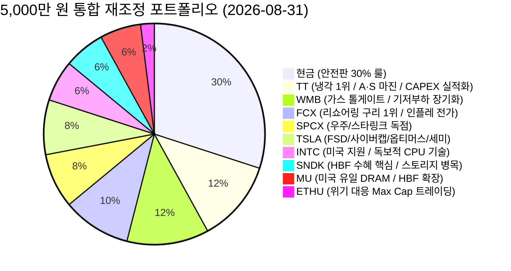

# 📊 실전 포트폴리오 통합 및 비중 재조정 보고서 (2026-08-31_portfolio_merge.md)

> **기준 시스템**: [6gj.md (육과장 투자 방법론 표준 지침서)](file:///d:/anti_py/6gj.md)  
> **운용 전략**: 6gj.md의 시스템적 리스크 관리(현금 30%, 분할 매수, 손익 관리) + **사용자 고유의 핵심 산업 인사이트 융합**  
> **총 운용 시드**: **50,000,000원 (5천만 원 기준)**

---

## 1. 포트폴리오 비중 재조정 총괄 배분표

사용자가 제시한 **HBF(고대역폭 플래시) 수혜(SNDK, MU)**, **미국 정부 투자 및 CPU 공급 대응력(INTC)**, **가스 발전의 장기 집권 및 A/S 현금흐름(WMB)**, **냉각 CAPEX 실적화 및 고마진 A/S(TT)**, **리쇼어링 구리 수요(FCX)**, **테슬라 4대 트리거(TSLA)**를 반영하여 종목 비중을 최적화하여 재배분하였습니다.



| 티커 | 종목명 | 핵심 테마 & 포지션 | 목표 비중 | 배정 총액 | 1차 매수 (즉시/조건) | 예비금 (-40%/-60% 대비) |
| :--- | :--- | :--- | :---: | :---: | :---: | :---: |
| **CASH** | **달러 MMF / 단기채** | 최후의 안전판 (현금 30% 룰) | **30%** | **1,500만 원** | - | 1,500만 원 |
| **TT** | 트레인 테크놀로지스 | AI 데이터센터 냉각 1위 + A/S 고마진 | **12%** | **600만 원** | 360만 원 (60%) | 240만 원 (40%) |
| **WMB** | 윌리엄스 컴퍼니스 | 美 가스 파이프라인 30% + FCF 창출 | **12%** | **600만 원** | 360만 원 (60%) | 240만 원 (40%) |
| **FCX** | 프리포트 맥모란 | 전력망/리쇼어링 필수 구리 1위 | **10%** | **500만 원** | 300만 원 (60%) | 200만 원 (40%) |
| **SPCX** | 스페이스X / 우주인프라 | 우주/위성통신망 독점 메가트렌드 | **8%** | **400만 원** | 200만 원 *(조건부)* | 200만 원 |
| **TSLA** | 테슬라 | FSD·로보택시·옵티머스·세미트럭 | **8%** | **400만 원** | 200만 원 *(조건부)* | 200만 원 |
| **INTC** | 인텔 | 美 정부 투자 + x86 CPU 기술력 | **6%** | **300만 원** | 150만 원 *(조건부)* | 150만 원 |
| **SNDK** | 샌디스크 / WDC | **HBF(고대역폭 플래시) 최대 수혜** | **6%** | **300만 원** | 150만 원 (50%) | 150만 원 (50%) |
| **MU** | 마이크론 | **美 유일 DRAM + 팹증설 + HBF** | **6%** | **300만 원** | 150만 원 (50%) | 150만 원 (50%) |
| **ETHU** | 이더리움 2배 | 고변동성 트레이딩 (Max Cap 강제) | **2%** | **100만 원** | 50만 원 *(조건부)* | 50만 원 |
| **합계** | **10개 자산군** | | **100%** | **5,000만 원** | **1,920만 원 (38.4%)** | **3,080만 원 (61.6%)** |

---

## 2. 통합 밸류체인 시너지 구조도

```mermaid
graph TD
    subgraph 1. 에너지 및 원자재 인프라 (기저부하)
        WMB["WMB (천연가스 수송 30%)<br>- 원자력 지연에 따른 가스 발전 장기 집권<br>- 안정적 A/S 및 FCF"]
        FCX["FCX (글로벌 구리 1위)<br>- 리쇼어링 송배전 및 전기회로 필수재<br>- 인플레 가격 전가 마진"]
    end

    subgraph 2. 데이터센터 열관리 및 전력 효율
        TT["TT (트레인 테크놀로지스)<br>- AI 칠러/냉각 1위 (52주 신고가)<br>- CAPEX 실적화 + 고마진 A/S"]
    end

    subgraph 3. 차세대 AI 반도체 & 스토리지 병목 해결
        INTC["INTC (인텔)<br>- 美 국가 차원 팹 증설<br>- 독보적 CPU 기술로 공급난 방어"]
        MU["MU (마이크론)<br>- 美 유일 DRAM + 팹 공급 증대<br>- HBF 시장 후발 확장성"]
        SNDK["SNDK (샌디스크/WDC)<br>- HBF(High Bandwidth Flash) 핵심 수혜<br>- AI 스토리지 초고속화"]
    end

    subgraph 4. AI 실물 경제 & 피지컬 확장
        TSLA["TSLA (테슬라)<br>- FSD / 사이버캡 / 옵티머스 / 세미트럭"]
        SPCX["SPCX (스페이스X)<br>- 우주 데이터센터 / 스타링크 글로벌망"]
    end

    WMB --> TT
    FCX --> TT
    TT --> INTC
    TT --> MU
    TT --> SNDK
    INTC --> TSLA
    MU --> TSLA
    SNDK --> TSLA
    MU --> SPCX
    SNDK --> SPCX
```

---

## 3. 종목별 통합 선정 이유 및 투자 논리 (6gj.md + 사용자 관점)

### 1) TT (Trane Technologies) - 비중 12% (600만 원)
* **6gj.md 시스템 평가**: AI 냉각 1위 해자 + 52주 신고가 주도주 검증 완료.
* **사용자 통합 인사이트**:
  * **고마진 A/S 사업**: 장비 납품 후 지속적으로 수취하는 서비스 및 유지보수 매출의 높은 이익률.
  * **CAPEX 실적화 폭발**: 전 세계 빅테크들의 데이터센터 냉각 CAPEX가 실제 완공·출하되는 시점에 실적과 주가의 퀀텀 점프 기대.

---

### 2) WMB (The Williams Companies) - 비중 12% (600만 원)
* **6gj.md 시스템 평가**: 미국 천연가스 30% 수송 독점 파이프라인 (대체 불가능한 톨게이트).
* **사용자 통합 인사이트**:
  * **가스 A/S 및 인프라 증설에 따른 막대한 현금흐름**: 시설 확장과 다변화로 강력한 FCF 유지.
  * **천연가스 발전의 장기 집권**: 원자력(SMR)은 인허가 및 공기 지연으로 단기 도입이 어려우며, 가스 수송망만 원활하다면 현실적 핵심 에너지원으로서 시장 예상보다 훨씬 장기간 메인 기저부하 지위를 유지.

---

### 3) FCX (Freeport-McMoRan) - 비중 10% (500만 원)
* **6gj.md 시스템 평가**: 공급 탄력성이 제한된 글로벌 1위 구리 채굴 기업 (1~2년 묻어두기 톨게이트).
* **사용자 통합 인사이트**:
  * **미국 리쇼어링(Reshoring) 직결 수혜**: 제조업 본토 회귀 및 송·배전망, 전기회로 인프라의 핵심 구리 수요를 직접 흡수.
  * **규제/세금 방어 및 인플레 전가**: 미국 내 세금 걱정이 덜한 원자재 산업이며, 물가 상승 시 판가 인상을 통한 마진 확대 향유.

---

### 4) SPCX (스페이스X / 우주인프라) - 비중 8% (400만 원)
* **6gj.md 시스템 평가**: 우주 데이터센터 및 스타링크 글로벌 인터넷망 독점.
* **사용자 통합 인사이트**:
  * 발사체 재사용 기반의 압도적 원가 해자. **고점 대비 -40%~-50% 폭락 확인 시 1차 분할 매수** 룰 적용.

---

### 5) TSLA (Tesla) - 비중 8% (400만 원)
* **6gj.md 시스템 평가**: 자율주행, 피지컬 AI 생태계 선도 (고변동성 깊은 눌림목 분할 진입).
* **사용자 통합 인사이트**:
  * 단기 비중을 보수적으로 잡되, **4대 성장 폭발 트리거**(① FSD 법규 완화, ② 사이버캡 상용화, ③ 옵티머스 팩토리 투입 가속, ④ 세미 트럭 운송 물류 매출 폭증) 발생 시 계좌 수익 견인.

---

### 6) INTC (Intel) - 비중 6% (300만 원)
* **6gj.md 시스템 평가**: 주봉 정배열 대세 상승 추세 유지 중 -37% 가격 조정(26주선 지지 테스트).
* **사용자 통합 인사이트**:
  * **미국 정부 전폭 지원**: 칩스법 기반 메가팹 증설 진행.
  * **독보적 CPU 기술력**: 타사가 넘보기 힘든 x86 CPU 경쟁력을 보유하여, 향후 AI 서버 호스트 CPU 및 차세대 PC 공급 부족 이슈 발생 시 주도적으로 공급 대응 및 마진 회수.

---

### 7) SNDK (SanDisk / WDC) - 비중 6% (300만 원) *(비중 상향)*
* **6gj.md 시스템 평가**: 낸드/스토리지 밸류체인.
* **사용자 통합 인사이트**:
  * **HBF(High Bandwidth Flash) 최대 수혜**: AI 연산 병목을 해결할 차세대 초고속 플래시 메모리(HBF) 시장 개화의 가장 직접적이고 핵심적인 수혜주로 비중 확대.

---

### 8) MU (Micron Technology) - 비중 6% (300만 원) *(비중 상향)*
* **6gj.md 시스템 평가**: AI 서버용 고성능 메모리 과점 공급사.
* **사용자 통합 인사이트**:
  * **미국 유일 DRAM 기업**: 미국 정부의 공급망 안보 핵심 수혜.
  * **공장 증설 공급 증대 & HBF 확장성**: 아이다호/뉴욕 메가팹 증설을 통한 선제적 캐파 확대 및 HBF 시장의 강력한 후발 수혜 잠재력.

---

### 9) ETHU (이더리움 2배) - 비중 2% (100만 원)
* **6gj.md 시스템 평가**: **Max Cap(최대 100만 원) 강제 잠금**. 시장 투매/반대매매 패닉 시에만 1차 50만 원 진입 후 20~30% 단기 반등 시 즉시 익절.

---

## 4. 실전 포트폴리오 운용 매뉴얼 (6gj.md 원칙)

1. **초기 진입 단계**:
   * 전체 5,000만 원 중 **38.4%(1,920만 원)만 1차 매수로 집행**하고, 나머지 **61.6%(3,080만 원)는 현금/예비금**으로 대기합니다.
2. **추가매수 엄격 통제**:
   * -10%, -20%의 일상적인 조정에는 절대 물타기를 하지 않습니다.
   * 내 평단 대비 **-40% 도달 시 배정 예비금(2차 매수)**, **-60% 폭락 시 3차 매수**를 기계적으로 집행합니다.
3. **주봉 MACD 음전 대응**:
   * 주봉 MACD OSC가 음전되면 이유를 불문하고 **보유 물량의 20%를 즉시 매도하여 현금화**하며, 다시 양전되어도 재매수하지 않습니다.
4. **+200% 원금 전액 회수**:
   * 종목 수익률이 +200%에 도달하면 **초기 투자 원금을 100% 회수**하여 무위험 복리 상태로 전환합니다.
