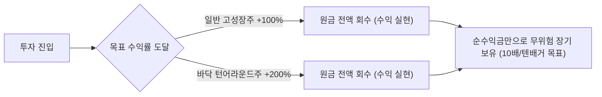

# 🏛️ 육과장 투자 방법론 표준 지침서 (6gj.md)

> **핵심 철학**
> * **"투자는 확률과 구조의 싸움이다."** (감정과 속도 배제, 지표 최소화)
> * **"우리는 시장보다 똑똑하지 않다."** (집단지성이 차트와 가격에 녹아있음)
> * **"영원히 이기는 시스템을 만든다."** (진입-보유-익절-청산의 기계적 룰 준수)
> * **"돈을 벌면 무엇을 살까가 아니라, 무엇을 '하지 않아도 될까'를 생각한다."** (출근·싫은 관계·감정 소모 배제)

---

## 1. 종목 선정 및 필터링 알고리즘 (Screening Rules)

신규 종목 발굴 시 아래 **3대 필수 기본 요건**과 **차트 검증 기준**을 모두 통과해야만 매수 대상(Universe)으로 등록한다.

### [기본 분석 필터 - 필수 3요소]
1. **메가트렌드 (Mega Trend)**: 거스를 수 없는 산업적 확장 방향성.
   * **반도체 생태계**: AI 발전은 확정된 미래 (CAPEX 투자 필수 → HBM, HBF, 메모리, GPU, CPU 등 전방위 확장).
   * **송·배·발 (송전·배전·발전)**: AI 및 데이터센터 전력 수요 폭증에 따른 필수 유틸리티/전력망 인프라.
   * **에너지 & 인프라 건설**: 미국의 에너지 패권(가스/원유) 강화에 따른 미국 가스 에너지 기업 및 국내외 원전·가스 인프라 건설사.
2. **경제적 해자 (Economic Moat)**: 독점적 지위, 높은 진입장벽, 대체 불가능한 기술/네트워크.
3. **수직계열화 및 톨게이트 (Vertical Integration & Bottleneck)**:
   * 자체 밸류체인 내재화 및 원가/품질 통제력 보유.
   * 시장 성장의 과실을 반드시 통과해야 하는 **‘병목(톨게이트)’** 지위를 점유하고 있는가?

### [차트 및 시장 검증 필터]
* **횡보장 속 지수 대비 상대 강도 및 '전고점 돌파 양봉' 발굴**:
  1. 시가총액 상위 1~100위 대형 우량주 차트를 전수 조사.
  2. 코스피 지수는 박스권 횡보/전고점 돌파를 못하고 있는데, **지수보다 강하게 전고점을 뚫어낸 종목** 선별.
  3. ❌ **노이즈 필터링**: 단순 단기 이슈(전쟁/방산/일시적 테마) 종목은 제외하고 산업 펀더멘털을 갖춘 주도주만 선정.
* ❌ **절대 매수 금지 (바닥주/역배열 배제 원칙)**:
  * 차트가 바닥에 깔려 역배열인 종목은 아무리 싸 보여도 절대 매수하지 않는다 (시장의 집단지성이 탈락시킨 종목).
  * "오른 것을 팔아서 떨어진 것을 사는 행위"는 절대 금지.

---

## 2. 자산 배분 및 3단계 포트폴리오 피라미드

```
                 ▲
                / \
               /   \      [ 3단계: 개별 알파 종목 ]
              / 개별 \     턴어라운드/고성장 개별주 (키옥시아, 소프트뱅크, 소니 등)
             /  종목  \
            /----------\
           /            \   [ 2단계: 메가트렌드 핵심 섹터 ETF ]
          /  핵심 섹터   \   반도체, AI, 헬스케어, 송·배·발(전력), 가스 에너지
         /      ETF      \
        /------------------\
       /                    \ [ 1단계: 미국 대표 지수 ETF ]
      /      지수 (Index)    \ S&P500 (SPY), 나스닥100 (QQQ) 등 (자산 방어/인플레 헤지)
     /________________________\
```

1. **미국 자산(미장) 50% 이상 필수 배정**:
   * 기축통화국의 무제한 화폐 발행 → 화폐가치 하락 → **실물 자산(지수/우량주) 우상향**.
   * 미국 지수는 역사적으로 연평균 10~15% 상승하므로 인플레이션 완벽 헤지.
2. **국내 시장(국장) 특수 진입 공식 (PBR 0.8 룰)**:
   * 평소에는 시스템적 한계로 국장에 보수적이나, **코스피 PBR 0.8 이하** 구간은 1년 내 최저 15%+ 수익이 나는 역사적 기회.
   * PBR 0.8 이하 도달 시 달러→원화 환전 후 국장 주도주(반도체, 송배발, 건설)에 집중 베팅.
3. **성향별 포트 구성비**:
   * **초보/보수적 투자자**: 지수(50% 이상) + 섹터(30%) + 개별주(20% 이하)
   * **공격적/성장형 투자자**: 지수(20%) + 섹터(30%) + 개별주(50%)
4. **기본 현금 비중**:
   * **주식 자산 70% : 현금 자산 30%** (시장 급변 및 폭락 대응 여력 상시 확보).

---

## 3. 매수 및 진입 알고리즘 (Entry Rules)

* **1차 매수 (진입)**:
  * 종목 선정 조건 충족 시 지표 타이밍을 재지 않고 배정 비중으로 즉시 1차 매수.
  * 횡보 구간에서 **전고점을 뚫어내는 기준 양봉** 출현 시 확실한 비중으로 진입.
  * 고변동성 성장주의 경우 고점 대비 **-40% ~ -50% 이상 가격 조정(반토막)**이 확인된 구간에서 1차 진입.
* **추가 매수 (기계적 피라미딩 물타기 룰)**:
  * **잔파동 구간 (-40% 미만 하락)**: **일체 추가매수/물타기 금지** (관망 및 대기).
  * **1차 추가매수**: 내 평단 대비 **-40%** 도달 시 2차 매수 집행.
  * **2차 추가매수**: 내 평단 대비 **-60%** 도달 시 3차 매수 집행.
* ❌ **상승 시 불타기(피라미딩) 절대 금지**:
  * 주가가 위로 올라갈수록 시드를 키우면 고점에서 단 한 번의 폭락에 계좌가 파괴됨.
  * 하락 시 분할 매수한 물량은 반등 후 **전고점 돌파 시 추가 매수했던 비중만큼 다시 현금화**하여 원래 비중 유지.

---

## 4. 손절 및 리스크 관리 (Stop-loss & Defense Rules)

* **전고점 돌파 양봉 이탈 시 칼손절 (신호 손절)**:
  * 횡보를 뚫어냈던 **기준 양봉의 저가를 이탈(하향 돌파)하면 즉시 기계적 전량 손절**.
  * 내 생각이 틀렸음을 즉각 인정하고 손실을 최소화.
* **추세 둔화 대응**:
  * **주봉 MACD OSC 음전(Minus) 발생 시**: 보유 비중의 **20% 즉시 매도 축소**.
  * **재매수 금지 룰**: 한 번 축소한 물량은 주봉 MACD가 다시 양전되더라도 **절대 재매수하지 않음** (남은 수량으로만 목표치까지 홀딩).

---

## 5. 수익 실현 및 영원히 이기는 매매법 (Exit & Profit Rules)

> *"너무 일찍 팔면 자산이 안 불어나고, 끝까지 쥐고 있으면 제자리로 돌아와 허탈함만 남는다. 그 절묘한 타협점이 바로 원금회수법이다."*



* **1단계: 원금 전액 회수법 (100% or 200% Rule)**
  * **일반 고성장/알파 종목**: 수익률 **+100% (2배)** 달성 시 **초기 투자 원금 전액 회수** (예: 1,000만 → 2,000만 도달 시 1,000만 인출).
  * **바닥 턴어라운드 종목**: 수익률 **+200% (3배)** 달성 시 **초기 투자 원금 전액 회수** (예: 1,000만 → 3,000만 도달 시 1,000만 인출, 남은 2,000만 원으로 복리 극대화).
  * 원금 회수 후 해당 종목의 위험 노출액은 0원이 되며, 순수익금만으로 **텐배거(10배/1,000%)**까지 멘탈 흔들림 없이 장기 보유.
* **2단계: 복리의 마법 활용 (시간의 숙성)**
  * 누적 수익률이 쌓인 상태(예: +500%)에서는 하루 20%만 올라도 원금 기준 +120%가 폭증함.
  * 소액/직장인은 조급한 단타를 버리고 우량주/ETF를 2~5년 이상 묵히며 복리를 취함.
* **3단계: 최종 전량 청산 (Exit Rule)**
  * 매수 전제(메가트렌드, 해자, 톨게이트 지위)가 훼손되었거나 기업 펀더멘털에 치명적 오류가 확인된 경우 **수익/손실률에 상관없이 즉시 전량 매도(Exit)**.

---

## 6. 실전 매매 자가 체크리스트

1. [ ] 이 종목은 **메가트렌드(반도체/송배발/에너지) / 경제적 해자 / 톨게이트**를 만족하는가?
2. [ ] 코스피 지수가 횡보할 때 **전고점을 돌파한 기준 양봉** 종목인가? (단기 테마/노이즈 제외)
3. [ ] 기준 양봉의 저가를 이탈했을 때 망설임 없이 **기계적 칼손절**할 준비가 되어 있는가?
4. [ ] 주가가 올라갈수록 위에서 비중을 늘리는 **불타기(피라미딩)**를 범하고 있지 않은가?
5. [ ] **+100% 또는 +200%**에 도달하여 **원금을 회수**하고 무위험 장기 복리 모드로 전환했는가?
6. [ ] 코스피 **PBR 0.8 이하** 구간에서 주도 섹터(반도체/송배발/건설)에 과감히 비중을 실었는가?
7. [ ] 전체 포트폴리오의 **50% 이상이 미국 지수/핵심 섹터**에 배정되어 있는가?
