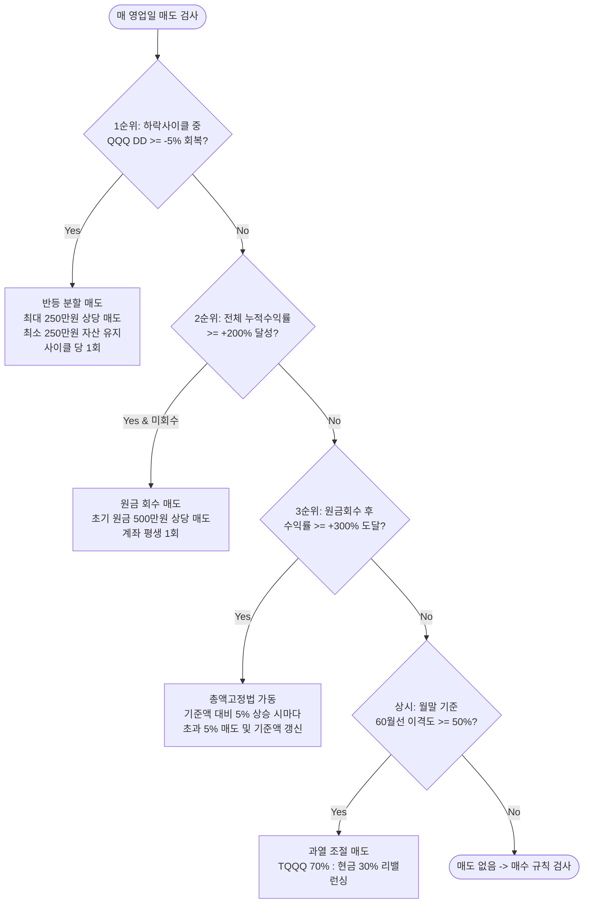

# 📘 QQQ-TQQQ 퀀트 자산배분 및 분할 매매 투자 지침서

> 본 문서는 **QQQ(나스닥 100 지수)**의 시장 지표를 기반으로 **TQQQ(3배 레버리지 ETF)**를 정밀 분할 매수/매도하여 변동성을 극복하고 장기 복리 수익을 극대화하는 퀀트 트레이딩 운용 지침서입니다.

---

## 📌 1. 기본 원칙 및 자본 운용 설정

| 항목 | 설정 기준 | 세부 내용 |
| :--- | :--- | :--- |
| **신호 감지 종목** | `QQQ` | 인덱스 고점 대비 하락률(DD) 및 60개월 이동평균선 감지용 |
| **실제 매매 종목** | `TQQQ` | 실제 매수/매도 집행 대상 (ProShares UltraPro QQQ) |
| **초기 투자금** | **5,000,000 KRW** | 시작일 기준 환율(USDKRW)로 전액 USD 환전하여 운용 |
| **기본 통화** | **USD (달러)** | 모든 주식 및 예수금은 100% USD로 계산 (UI 표시는 최신 환율 병기) |
| **Day 1 초기 진입** | **250만 원 상당 정수 매수** | 투자 시작일 당일 2,500,000 KRW 상당의 USD로 TQQQ 정수 주수 즉시 매수 후 시작 |
| **주문 단위** | **정수 1주 단위** | 모든 매수 및 매도는 정수(Integer) 1주 단위로 체결 |

---

## 📊 2. 핵심 시장 지표 정의

1. **사상 최고가 (ATH - All Time High)**
   - QQQ의 누적 최고가: $\text{QQQ ATH} = \max(\text{QQQ High})$
2. **고점 대비 하락률 (DD - Drawdown %)**
   - 현재 QQQ 종가의 최고점 대비 낙폭:
     $$\text{QQQ DD (\%)} = \frac{\text{QQQ Close} - \text{QQQ ATH}}{\text{QQQ ATH}} \times 100$$
3. **월봉 60개월 이격도 (60-Month Disparity %)**
   - QQQ 1,260영업일(약 60개월) 단순이동평균 대비 상승 괴리율:
     $$\text{Disparity (\%)} = \left( \frac{\text{QQQ Close}}{\text{MA}_{1260}} - 1.0 \right) \times 100$$

---

## 🔄 3. 사이클 상태 관리 (State Machine)

하락장의 시작과 회복을 감지하여 전략 상태를 자동으로 전환합니다.

```mermaid
stateDiagram-v2
    [*] --> 평시_관망구간 : QQQ DD > -10%
    평시_관망구간 --> 하락사이클_진입 : QQQ DD <= -10% (cycle_in_dd10 = True)
    
    state 하락사이클_진입 {
        -10_to_-15 : 매일 1주 분할 매수
        -15_to_-20 : TQQQ 80% 리밸런싱 (1회)
        under_-20 : TQQQ 90% 리밸런싱 (1회)
    }
    
    하락사이클_진입 --> 반등분할매도 : QQQ DD >= -5% 회복 (250만원 한도 매도)
    반등분할매도 --> 평시_관망구간 : QQQ DD >= -0.5% (신고가 근접 시 사이클 완전 리셋)
```

- **하락 사이클 진입**: QQQ DD가 **-10% 이하**로 내려가면 `cycle_in_dd10 = True`로 활성화.
- **사이클 리셋**: QQQ DD가 **-0.5% 이내**(사상 최고가 수준)로 회복되면 하락 사이클 및 리밸런싱 상태를 완전히 초기화.

---

## 🛒 4. 하락장 매수 규칙 (Buy Rules)

당일 매도 조건이 발생하지 않은 영업일에 대해 QQQ DD 구간별로 차등 매수를 집행합니다.

| QQQ 고점 대비 하락률 (DD) | 매수 행동 지침 | 세부 집행 룰 |
| :--- | :--- | :--- |
| **$0\% \sim -10\%$ 미만** | **신규 매수 절대 금지** | 관망 및 현금 보존 상태 유지 |
| **$-10\% \sim -15\%$ 구간** | **매일 1주 정량 분할 매수** | 가용 USD 예수금이 있는 한 매 영업일 TQQQ 1주씩 매수 |
| **$-15\% \sim -20\%$ 구간** | **8:2 비중 리밸런싱** | 전체 자산 대비 [TQQQ 80% : 현금 20%]가 되도록 TQQQ 매수 (구간 진입 시 1회) |
| **$-20\%$ 초과 대하락 구간** | **9:1 비중 적극 리밸런싱** | 전체 자산 대비 [TQQQ 90% : 현금 10%]가 되도록 TQQQ 매수 (구간 진입 시 1회) |

---

## 💰 5. 매도 및 익절 규칙 (Sell Rules)

매 영업일 **우선순위가 가장 높은 1개 조건**이 발동되면 즉시 실행합니다.



### 1순위: 반등 분할 매도 (Cycle Rebound Exit)
- **조건**: `cycle_in_dd10 == True` 상태에서 QQQ가 고점 대비 **-5% 이내로 회복**할 때
- **매도량**: **TQQQ 주식 평가액이 최소 250만 원 상당(USD)은 계좌에 반드시 유지**되도록 하고, 250만 원을 초과하는 TQQQ 주식 평가액(하락 중 분할 매수한 추가 주수 등)만 **원화 250만 원 상당 한도 내에서 분할 매도**하여 익절
- **안전장치**: TQQQ 주식 잔고가 최소 250만 원 상당은 계속 유지되므로 주식을 전량 매도하지 않음 (해당 하락 사이클에서 1회만 실행)

### 2순위: 원금 회수 (Principal Recovery)
- **조건**: 계좌 전체 누적 수익률(초기 USD 원금 대비)이 **+200% 이상** 도달 시
- **매도량**: **초기 원금(500만 원 상당 USD)**에 해당하는 금액만큼 TQQQ를 매도하여 USD 현금으로 확보 (계좌 평생 1회 실행)

### 3순위: 총액고정법 (Profit Locking Method)
- **조건**: 원금 회수가 완료된 후, 전체 수익률이 **+300% 이상** 도달 시 최초 총자산을 `lock_base_value`로 설정
- **실행**: 총자산 평가액이 기준액 대비 **5% 초과 상승할 때마다 초과된 5% 분량을 매도**하여 현금화하고 기준액을 최신 자산액으로 갱신

### 상시: 월봉 이격도 과열 조절 (Monthly Disparity Rebalancing)
- **조건**: **월말 영업일** 기준 QQQ 60개월선 이격도가 **50% 이상** 과열 시
- **실행**: 포트폴리오 비중을 **[TQQQ 70% : 현금 30%]**로 맞추기 위해 초과된 TQQQ 매도

> **공통 규칙**: 모든 매도는 정수 1주 단위 계산으로 인해 현금 비중이 소폭 초과(예: 7.9:2.1)되는 것을 정상 허용합니다.

---

## 🛠️ 6. 자동화 파이프라인 및 모니터링 시스템

- **데이터 수집 및 연산 (`build.py`)**: `yfinance`를 통해 QQQ, TQQQ, USDKRW 최신 시세를 수집하고 매매 룰을 시뮬레이션하여 완성형 `index.html` 생성.
- **자동 배치 스케줄러 (`.github/workflows/update.yml`)**: 매일 미국 증시 마감 직후 (화~토 한국시간 07:00 / UTC 22:00) GitHub Actions가 자동 실행.
- **MTS 대시보드 (`GitHub Pages`)**:
  - **`[계좌 잔고]` 탭**: 총 평가금액, 달러 예수금, 오늘의 주문 가이드, TQQQ 보유 수량 및 수익률 요약
  - **`[체결 내역]` 탭**: 투자 시작일부터 체결된 모든 매수/매도 거래 기록 (체결일, 단가, 수량, 환산액, 전략 사유)
- **배포 주소**: `https://dokata823-gif.github.io/tqqq-quant-dashboard/`
