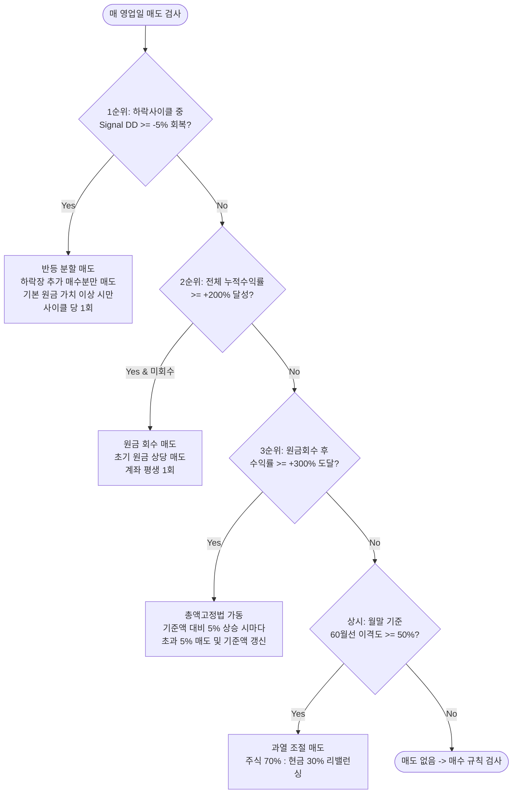

# 📘 QQQ 기반 TQQQ & SOXL & QLD 멀티 계좌 퀀트 자산배분 및 분할 매매 투자 지침서

> 본 문서는 **QQQ(나스닥 100 지수)**의 시장 지표(고점 낙폭 DD, 60개월 이격도)를 마스터 신호로 삼아, **TQQQ(나스닥 3배)**, **SOXL(반도체 3배)**, **QLD(나스닥 2배)**를 각각 독립된 계좌에서 정밀 분할 매매/자산배분하여 변동성을 극복하고 장기 복리 수익을 극대화하는 퀀트 트레이딩 운용 지침서입니다.

---

## 📌 1. 멀티 계좌 기본 원칙 및 자본 운용 설정

| 항목 | 계좌 1: 나스닥 3X (TQQQ) | 계좌 2: 반도체 3X (SOXL) | 계좌 3: 나스닥 2X (QLD) |
| :--- | :--- | :--- | :--- |
| **계좌 명칭** | 위탁종합 (나스닥 3X) | 위탁종합 (반도체 3X) | 위탁종합 (나스닥 2X) |
| **계좌 번호** | `112-92-****01` | `112-92-****02` | `112-92-****03` |
| **마스터 신호 지표** | **`QQQ` (Invesco QQQ Trust)** | **`QQQ` (Invesco QQQ Trust)** | **`QQQ` (Invesco QQQ Trust)** |
| **실제 매매 종목** | `TQQQ` (ProShares UltraPro QQQ) | `SOXL` (Direxion Daily Semiconductor 3X) | `QLD` (ProShares Ultra QQQ) |
| **투자 시작일** | **2026년 6월 3일** | **2026년 9월 30일** | **2013년 1월 7일** |
| **계좌별 초기 투자금** | **₩5,000,000** (시작일 환율 전액 USD 환전) | **₩7,500,000** (시작일 환율 전액 USD 환전) | **₩5,000,000** (시작일 환율 전액 USD 환전) |
| **Day 1 초기 진입** | **₩2,500,000 상당 TQQQ 정수 매수** | **₩2,500,000 상당 SOXL 정수 매수** | **₩5,000,000 전액 QLD 정수 매수** |
| **레버리지 매수 상한** | **최대 250만 원 한도 적용** | **최대 250만 원 한도 적용** | **상한 룰 제외 (원금 100% 진입)** |
| **주문 단위** | 정수(Integer) 1주 단위 | 정수(Integer) 1주 단위 | 정수(Integer) 1주 단위 |

> **⭐ 레버리지 매수 상한 룰 적용 규칙**: 
> - **3배 레버리지(TQQQ, SOXL)**: 고변동성 리스크 관리를 위해 **매수 투입 금액을 최대 250만 원으로 제한**하며, Day 1에도 250만 원 상당의 정수 주수만 매수하고 잔여금은 USD 현금으로 보유합니다.
> - **2배 레버리지(QLD)**: 상대적으로 변동성이 낮고 장기 복리 효율이 우수하므로 **250만 원 매수 상한 룰에서 제외**하여 Day 1에 **초기 원금 100%(₩5,000,000 상당)를 전액 매수 진입**합니다.

---

## 📊 2. 핵심 시장 지표 정의 (계좌별 독립 산출)

1. **사상 최고가 (ATH - All Time High)**
   - 신호 종목(QQQ)의 누적 최고가: $\text{Signal ATH} = \max(\text{Signal High})$
2. **고점 대비 하락률 (DD - Drawdown %)**
   - 현재 신호 종목 종가의 최고점 대비 낙폭:
     $$\text{Signal DD (\%)} = \frac{\text{Signal Close} - \text{Signal ATH}}{\text{Signal ATH}} \times 100$$
3. **월봉 60개월 이격도 (60-Month Disparity %)**
   - 신호 종목 1,260영업일(약 60개월) 단순이동평균 대비 상승 괴리율:
     $$\text{Disparity (\%)} = \left( \frac{\text{Signal Close}}{\text{MA}_{1260}} - 1.0 \right) \times 100$$

---

## 🔄 3. 사이클 상태 관리 (State Machine)

각 계좌는 독립된 상태 머신을 가지며 신호 종목의 하락장을 감지하여 대응합니다.

```mermaid
stateDiagram-v2
    [*] --> 평시_관망구간 : Signal DD > -10%
    평시_관망구간 --> 하락사이클_진입 : Signal DD <= -10% (cycle_in_dd10 = True)
    
    state 하락사이클_진입 {
        -10_to_-15 : 매일 1주 분할 매수
        -15_to_-20 : 레버리지 80% 리밸런싱 (1회)
        under_-20 : 레버리지 90% 리밸런싱 (1회)
    }
    
    하락사이클_진입 --> 반등분할매도 : Signal DD >= -5% 회복 (하락장 추가 매수분만 익절)
    반등분할매도 --> 평시_관망구간 : Signal DD >= -0.5% (신고가 근접 시 사이클 완전 리셋)
```

- **하락 사이클 진입**: Signal DD가 **-10% 이하**로 내려가면 `cycle_in_dd10 = True`로 활성화.
- **사이클 리셋**: Signal DD가 **-0.5% 이내**(신고가 수준)로 회복되면 하락 사이클 및 리밸런싱 상태를 완전히 초기화.

---

## 🛒 4. 하락장 매수 규칙 (Buy Rules)

당일 매도 조건이 발생하지 않은 영업일에 대해 Signal DD 구간별로 차등 매수를 집행합니다.

| Signal 고점 대비 하락률 (DD) | 매수 행동 지침 | 세부 집행 룰 |
| :--- | :--- | :--- |
| **$0\% \sim -10\%$ 미만** | **신규 매수 절대 금지** | 관망 및 현금 보존 상태 유지 |
| **$-10\% \sim -15\%$ 구간** | **매일 1주 정량 분할 매수** | 가용 USD 예수금이 있는 한 매 영업일 레버리지 1주씩 매수 |
| **$-15\% \sim -20\%$ 구간** | **8:2 비중 리밸런싱** | 전체 자산 대비 [주식 80% : 현금 20%]가 되도록 매수 (구간 진입 시 1회) |
| **$-20\%$ 초과 대하락 구간** | **9:1 비중 적극 리밸런싱** | 전체 자산 대비 [주식 90% : 현금 10%]가 되도록 매수 (구간 진입 시 1회) |

---

## 💰 5. 매도 및 익절 규칙 (Sell Rules)

매 영업일 **우선순위가 가장 높은 1개 조건**이 발동되면 즉시 실행합니다.



### 1순위: 반등 분할 매도 (Cycle Rebound Exit)
- **발동 조건**: Signal DD가 -10% 이하로 진입했던 하락 사이클(`cycle_in_dd10 == True`)에서 Signal이 고점 대비 **-5% 이내로 회복**할 때
- **매도 대상**: **해당 하락 사이클(-10% 이하 구간) 동안 추가로 분할 매수했던 주수(`cycle_bought_shares`)만 매도** (Day 1 초기 기본 보유 주수는 영구 보존)
- **수익 보호 조건**: 주식 총 평가액이 최소 기본 원금(상한 계좌는 250만 원, 미상한 계좌는 초기 원금 상당) 이상일 때만 매도 집행
- **실행 결과**: 하락장에서 분할 매수했던 추가 수량만 고점에서 깔끔하게 익절하여 예수금으로 회수 (해당 사이클에서 1회만 실행)

### 2순위: 원금 회수 (Principal Recovery)
- **조건**: 계좌 전체 누적 수익률(초기 USD 원금 대비)이 **+200% 이상** 도달 시
- **매도량**: **초기 원금(초기 투자금 상당 USD)**에 해당하는 금액만큼 레버리지 주식을 매도하여 USD 현금으로 확보 (계좌 평생 1회 실행)

### 3순위: 총액고정법 (Profit Locking Method)
- **조건**: 원금 회수가 완료된 후, 전체 수익률이 **+300% 이상** 도달 시 최초 총자산을 `lock_base_value`로 설정
- **실행**: 총자산 평가액이 기준액 대비 **5% 초과 상승할 때마다 초과된 5% 분량을 매도**하여 현금화하고 기준액을 최신 자산액으로 갱신

### 상시: 월봉 이격도 과열 조절 (Monthly Disparity Rebalancing)
- **조건**: **월말 영업일** 기준 신호 종목 60개월선 이격도가 **50% 이상** 과열 시
- **실행**: 포트폴리오 비중을 **[주식 70% : 현금 30%]**로 맞추기 위해 초과 주식 매도

---

## 🛠️ 6. 자동화 파이프라인 및 MTS 대시보드

- **멀티 계좌 실시간 전환**: 상단 메인 탭(`[TQQQ]` / `[SOXL]` / `[QLD]`)을 통해 원클릭으로 계좌를 즉시 전환.
- **계좌별 서브 탭**: 각 계좌마다 `[계좌 잔고]` 및 `[전체 체결 내역]` 탭을 독립적으로 제공.
- **배포 주소**: `https://dokata823-gif.github.io/tqqq-quant-dashboard/`
