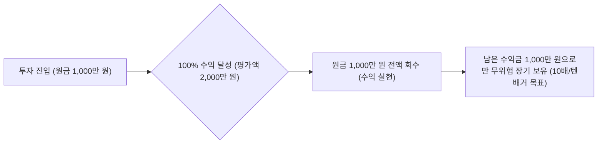

# [유튜브 요약] 580% 수익 파이어족의 주식 투자 비법 및 포트폴리오 전략

- **영상 출처**: [YouTube 영상 바로가기](https://youtu.be/-A0tSDnS830?si=-mEjcXudmvVAERgP)
- **출연진**: 유과장 (파이어족, 24만/투자 채널 운영자, 게스트) & 호동/김PD (진행자)
- **핵심 주제**: 국장/미장 실전 매매 전략, 주도주 선별법, 영원히 이기는 매매법(원금회수법), 파이어족의 삶과 돈의 본질

---

## 📌 목차
1. [투자 성과 및 최근 근황](#1-투자-성과-및-최근-근황)
2. [국내 주식 vs 미국 주식 접근법](#2-국내-주식-vs-미국-주식-접근법)
3. [실전 매매 전략: 주도주 발굴 & 비중 베팅법](#3-실전-매매-전략-주도주-발굴--비중-베팅법)
4. [핵심 매매 원칙: '영원히 이기는 매매법' (원금회수법)](#4-핵심-매매-원칙-영원히-이기는-매매법-원금회수법)
5. [초보자를 위한 3단계 포트폴리오 피라미드](#5-초보자를-위한-3단계-포트폴리오-피라미드)
6. [글로벌 정세 분석 및 유망 섹터 (에너지·인프라·반도체)](#6-글로벌-정세-분석-및-유망-섹터-에너지인프라반도체)
7. [파이어족(FIRE)이 말하는 돈의 본질과 행복](#7-파이어족fire이-말하는-돈의-본질과-행복)

---

## 1. 📊 투자 성과 및 최근 근황

- **실계좌 수익률 인증**:
  - 원금 약 4,600만 원으로 시작해 계좌 3개(3,200만 원, 1억 3,600만 원, 9,800만 원 등 실현) 토탈 **약 580% 누적 수익률 달성**.
- **리스크 관리**:
  - 최근 중동(이란) 전쟁 이슈 및 단기 급변동 직전에 현금 비중을 선제적으로 확보하며 방어.
- **파이어족 일상 & 기부**:
  - 자연 속 텃밭 농사(명이나물, 자연산 두릅 등)와 여유로운 삶 영위.
  - 책 출판 인세 전액을 결식아동 및 유기동물 보호 단체에 기부.

---

## 2. 🇰🇷 vs 🇺🇸 국내 주식과 미국 주식 접근법

### (1) 국내 주식 (국장): 밸류에이션 극저평가 구간 공략
- **기본 스탠스**: 물적분할, 상속 이슈, 지배구조 문제 등 시스템적 한계로 평소에는 국장에 비판적.
- **매수 공식 (PBR 기준)**:
  - 코스피 **PBR 0.8 이하**로 깨지는 구간은 역사적으로 1년 내 최저 15% 이상 수익이 나는 확률 높은 기회.
  - 2024년 12월 달러를 원화로 환전 후 2025년 1월부터 국장 본격 진입 → 폭발적인 수익 창출.
- **주도주 압축 원칙**:
  - 코스피의 본질은 시총 30%를 차지하는 **반도체(삼성전자, SK하이닉스)**.
  - 다른 잡주에 눈 돌리지 말고, 확실한 주도 섹터(**반도체**, **송·배·발(송전/배전/발전)**, **건설**)에 집중.

### (2) 미국 주식 (미장): 포트폴리오의 기본 50% 이상 배정
- **패권 국가의 무제한 화폐 발행**:
  - 미국은 기축통화 패권을 유지하며 달러를 무제한으로 찍어냄.
  - 화폐 발행 → 돈의 가치 하락 → **실물 자산(지수, 우량 주식, 부동산) 가격 상승**으로 연결.
- **인플레이션 완벽 헤지**:
  - 미국 대표 지수는 역사적으로 연평균 10~15% 수준 우상향.
  - 은행 예금(2%)에 머무는 것은 인플레이션으로 자산이 깎이는 것이므로, 지수 투자를 통해 자산을 방어하고 불려야 함.

---

## 3. 🎯 실전 매매 전략: 주도주 발굴 & 비중 베팅법

### (1) 횡보장 속 '신고가 양봉' 종목 발굴 4단계
1. **차트 전수 조사**: 코스피 시가총액 1위부터 100위까지의 대형주 차트를 모두 조회.
2. **지수 비교**: 코스피 지수는 박스권 횡보를 하고 있는데, 지수보다 강하게 움직이는 5~10개 종목을 1차 소팅.
3. **노이즈 필터링**: 단순 단기 테마(전쟁/방산/유가 급등 등)로 반짝 오르는 종목은 제외하고, 산업 펀더멘털을 갖춘 주도 섹터만 선별.
4. **전고점 돌파 양봉 공략**: 횡보 박스의 전고점을 강력하게 뚫어낸 양봉이 나온 우량주에 과감히 비중 베팅 (예: 삼성전기 등).

### (2) 철저한 손절 원칙과 비중 조절
- **손절 기준**: 전고점을 뚫어냈던 **기준 양봉의 저가를 이탈하면 뒤도 돌아보지 않고 즉시 기계적 손절**.
- **확실할 때 베팅**: 평소 10~20만 원 짤짤이 매매로 손실을 쌓지 말고, 승률이 매우 높고 확실한 대형 주도주에 큰 비중(억 단위 또는 신용 활용)을 싣고 큰 수익을 취함.
- **피라미딩(불타기) 금지 원칙**:
  - 주가가 위로 올라갈수록 시드를 키우면 고점에서 단 한 번의 폭락에 계좌가 망가짐.
  - 하락 시 계획된 분할 매수를 진행했더라도, 반등 후 **전고점을 돌파하면 추가 매수했던 비중은 다시 현금화하여 원래 비중을 유지**.

---

## 4. 💎 핵심 매매 원칙: '영원히 이기는 매매법' (원금회수법)

> *"조금 먹고 팔면 큰 자산이 안 되고, 끝까지 버티면 제자리로 돌아와 허탈함만 남는다. 그 중간의 해결책이 바로 원금회수법이다."*



### [원금회수법 핵심 요약]
1. **100% 원금회수법**:
   - 1,000만 원 투자 후 100% 상승(2,000만 원 도달) 시 원금 1,000만 원을 전액 계좌로 회수.
   - 남은 1,000만 원(순수 수익금)은 심리적 부담 없이 텐배거(10배)까지 장기 보유.
2. **200% 원금회수법 (바닥 턴어라운드 종목)**:
   - 강한 턴어라운드가 기대되는 종목은 200% 상승(1,000만 → 3,000만 원) 시 원금 1,000만 원 회수.
   - 남은 2,000만 원의 큰 시드로 장기 복리 극대화.
3. **적용 사례**:
   - **키옥시아(Kioxia)**: 이미 바닥 대비 400~500% 오른 상태에서 진입 후 100% 상승 시 원금 회수 → 현재 635% 누적 수익 진행 중.
   - **미국/중국 희토류 및 SMIC 등**: 원금을 모두 뺀 후 수익금으로만 편안하게 홀딩.

### 💡 복리의 마법 (누적 수익률의 힘)
- 누적 수익률이 500%인 상태에서 주가가 하루 **20%** 오르면, 내 최초 원금 기준으로는 하루 만에 **+120%**가 불어남.
- 직장인과 소액 투자자는 잦은 매매 대신 **시간의 복리**를 믿고 2~5년 진득하게 묻어두는 전략이 필수.

---

## 5. 🧱 초보자를 위한 3단계 포트폴리오 피라미드

```
                 ▲
                / \
               /   \      [ 3단계: 개별 알파 종목 ]
              / 개별 \     턴어라운드/고성장 개별주 (키옥시아, 소니, 샌디스크 등)
             /  종목  \
            /----------\
           /            \   [ 2단계: 메가트렌드 섹터 ETF ]
          /  핵심 섹터   \   반도체, AI, 헬스케어, 송배발/전력인프라, 가스
         /      ETF      \
        /------------------\
       /                    \ [ 1단계: 미국 대표 지수 ETF ]
      /      지수 (Index)    \ S&P500 (SPY), 나스닥100 (QQQ) 등 (자산 방어)
     /________________________\
```

- **보수적/초보 투자자**: 지수(50% 이상) + 섹터(30%) + 개별주(20% 이하)
- **공격적/젊은 투자자**: 지수(20%) + 섹터(30%) + 개별주(50%)

---

## 6. 🌐 글로벌 정세 분석 및 유망 섹터

### (1) 미국-중동(이란)/베네수엘라 사태의 본질
- **에너지 패권 및 페트로 달러 수호**:
  - 베네수엘라 유전 및 이란의 호르무즈 해협 통제권을 확보하여 전 세계 원유/가스 시장의 70% 통제권 유지.
  - 위안화 결제 차단 및 페트로 달러 체제 공고화.
  - 중동-인도-유럽 경제 벨트 완성 후 본격적인 대중국 견제 집중.
- **수혜 섹터**:
  - **미국 가스 에너지 & 인프라 운송 기업**
  - **한국/글로벌 원전 및 가스 인프라 건설사** (국내 건설주는 과거 부실시공 이슈로 극저평가 상태라 매력적).

### (2) 반도체 메가사이클 (AI 인프라 확충)
- AI 발전은 이미 정해진 미래이며, 글로벌 빅테크의 CAPEX(설비투자) 투자는 필연적.
- 메모리, HBM, HBF, CXL, 실리콘 포토닉스, GPU, CPU 등 반도체 생태계 전반이 지속 확장될 것이므로 반도체 포트폴리오는 필수 보유.

---

## 7. 🌿 파이어족(FIRE)이 말하는 돈의 본질과 행복

### 💡 돈을 벌었을 때 생각해야 할 질문의 전환
> ❌ **"돈을 벌면 무엇을 살까?"** (슈퍼카, 명품 등 소비에 집중)  
> ⭕ **"돈을 벌면 무엇을 '하지 않아도' 될까?"** (자유와 감정 소모 제거에 집중)

1. **원하지 않는 출근을 하지 않아도 됨.**
2. **보기 싫은 사람(직장 상사 등)을 억지로 만나지 않아도 됨.**
3. **불필요한 감정 소모와 나 자신을 갉아먹는 스트레스가 사라짐.**

### 🎯 진정한 은퇴 후의 삶
- 파이어를 했다고 해서 아무것도 안 하고 노는 것이 아님.
- **'생계를 위해 강제로 하는 노동'**에서 벗어나, **'내가 진정으로 즐길 수 있는 일(유튜브, 농사, 창작, 투자)'**을 하는 삶.
- 즐겁게 일하다 보면 스트레스가 없고, 그것이 자연스럽게 추가적인 부가 수익으로 이어짐.

---
*정리 일자: 2026-09-01*
